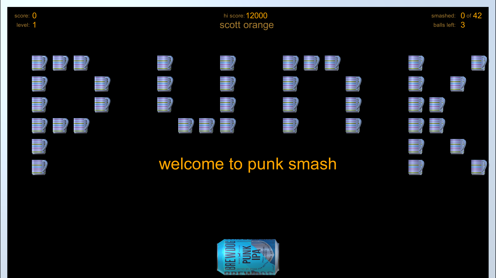
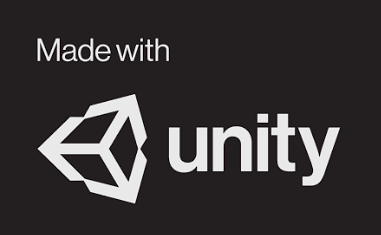

# Punk-Smash
I've finally completed my first Unity game and I'm extremely pleased with it.

The models were created with Blender (another fantastic free tool) and imported into Unity.

To play the game, just download [Punk-Smash_Setup.exe](https://github.com/scott-vincent/Punk-Smash/releases/download/v1.2/Punk-Smash_Setup.exe) and run it.

